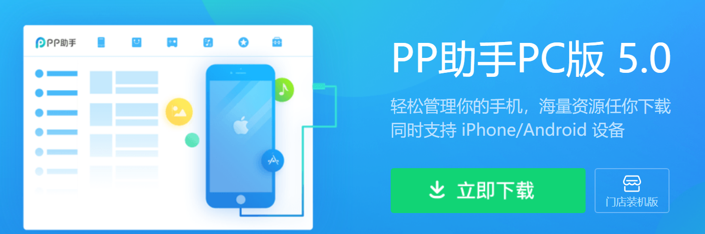
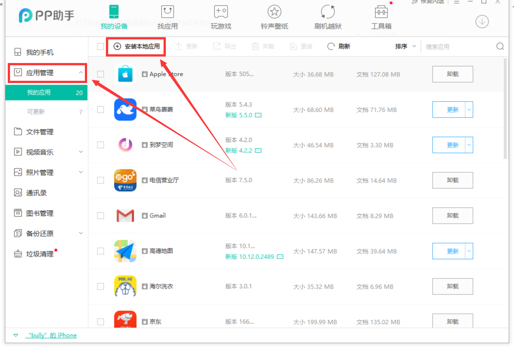
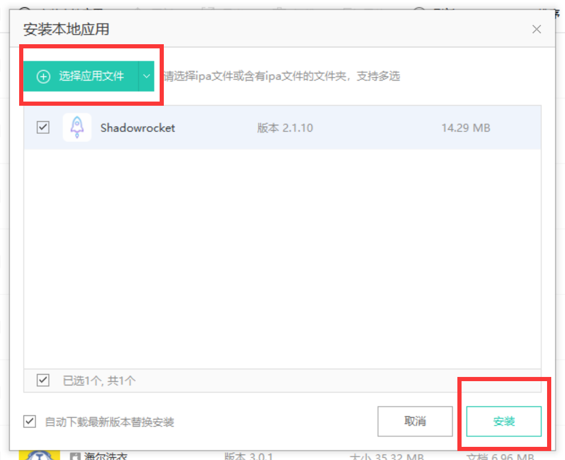

**提示：由于PP助手不再支持iOS，此仓库提供的安装方法已不再适用，或许你可以找一个美区账号登录后直接下载安装ShadowRocket。**

~~# ShadowRocket~~
~~众所周知因为某些原因大陆区用户apple id无法在app store下载ShadowRocket，但可以使用离线ipa文件安装此应用程序，安装方法如下：~~

~~1. **下载ShadowRocket的ipa文件 [下载链接](https://github.com/CQUWH/ShadowRocket/raw/master/Shadowrocket-2.1.10-PP.ipa)**~~

~~2. **在电脑上安装pp助手https://pro.25pp.com/**~~

   ~~~~

~~3. **打开pp助手并连接到ios设备(iPad iPhone)**~~

   ~~~~

~~4. **点击左侧应用管理后点击安装本地应用**~~

   ~~~~

~~5. **选则下载好的ipa文件后点击安装即可成功安装**~~

   ~~~~

~~**\# 本应用仅供学习交流，严禁用于商业用途，请遵守中华人民共和国相关法律制度！！！**~~
